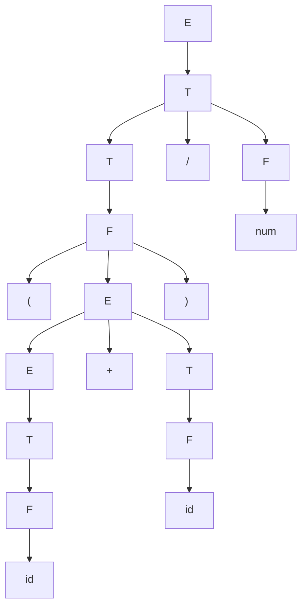

# Atividade 6 — Compiladores

## Questão 1 — Parser preditivo

### (a)

**Entrada:** `id + num / id $`

| Passo | Pilha         | Entrada           | Ação          |
|------:|---------------|-------------------|---------------|
|     1 | `$ E`         | `id + num / id $` | `E → T E′`    |
|     2 | `$ E′ T`      | `id + num / id $` | `T → F T′`    |
|     3 | `$ E′ T′ F`   | `id + num / id $` | `F → id`      |
|     4 | `$ E′ T′ id`  | `id + num / id $` | `match id`    |
|     5 | `$ E′ T′`     | `+ num / id $`    | `T′ → ε`      |
|     6 | `$ E′`        | `+ num / id $`    | `E′ → + T E′` |
|     7 | `$ E′ T +`    | `+ num / id $`    | `match +`     |
|     8 | `$ E′ T`      | `num / id $`      | `T → F T′`    |
|     9 | `$ E′ T′ F`   | `num / id $`      | `F → num`     |
|    10 | `$ E′ T′ num` | `num / id $`      | `match num`   |
|    11 | `$ E′ T′`     | `/ id $`          | `T′ → / F T′` |
|    12 | `$ E′ T′ F /` | `/ id $`          | `match /`     |
|    13 | `$ E′ T′ F`   | `id $`            | `F → id`      |
|    14 | `$ E′ T′ id`  | `id $`            | `match id`    |
|    15 | `$ E′ T′`     | `$`               | `T′ → ε`      |
|    16 | `$ E′`        | `$`               | `E′ → ε`      |
|    17 | `$`           | `$`               | `acc`         |

### (b)

**Entrada:** `( num ) $`

| Passo | Pilha                 | Entrada     | Ação        |
|------:|-----------------------|-------------|-------------|
|     1 | `$ E`                 | `( num ) $` | `E → T E′`  |
|     2 | `$ E′ T`              | `( num ) $` | `T → F T′`  |
|     3 | `$ E′ T′ F`           | `( num ) $` | `F → ( E )` |
|     4 | `$ E′ T′ ) E (`       | `( num ) $` | `match (`   |
|     5 | `$ E′ T′ ) E`         | `num ) $`   | `E → T E′`  |
|     6 | `$ E′ T′ ) E′ T`      | `num ) $`   | `T → F T′`  |
|     7 | `$ E′ T′ ) E′ T′ F`   | `num ) $`   | `F → num`   |
|     8 | `$ E′ T′ ) E′ T′ num` | `num ) $`   | `match num` |
|     9 | `$ E′ T′ ) E′ T′`     | `) $`       | `T′ → ε`    |
|    10 | `$ E′ T′ ) E′`        | `) $`       | `E′ → ε`    |
|    11 | `$ E′ T′ )`           | `) $`       | `match )`   |
|    12 | `$ E′ T′`             | `$`         | `T′ → ε`    |
|    13 | `$ E′`                | `$`         | `E′ → ε`    |
|    14 | `$`                   | `$`         | `acc`       |

**Número de passos:** 14 (13 ações antes da aceitação).

**Tokens consumidos:** 3

## Questão 2 — Parser SLR(1)

### (a)

**Entrada:** `id + num / id $`

| Passo | Estados         | Símbolos     | Entrada           | Ação            |
|------:|-----------------|--------------|-------------------|-----------------|
|     1 | `0`             | `vazia`      | `id + num / id $` | `s5`            |
|     2 | `0 5`           | `id`         | `+ num / id $`    | `r6: F → id`    |
|     3 | `0 3`           | `F`          | `+ num / id $`    | `r4: T → F`     |
|     4 | `0 2`           | `T`          | `+ num / id $`    | `r2: E → T`     |
|     5 | `0 1`           | `E`          | `+ num / id $`    | `s7`            |
|     6 | `0 1 7`         | `E +`        | `num / id $`      | `s6`            |
|     7 | `0 1 7 6`       | `E + num`    | `/ id $`          | `r7: F → num`   |
|     8 | `0 1 7 3`       | `E + F`      | `/ id $`          | `r4: T → F`     |
|     9 | `0 1 7 10`      | `E + T`      | `/ id $`          | `s8`            |
|    10 | `0 1 7 10 8`    | `E + T /`    | `id $`            | `s5`            |
|    11 | `0 1 7 10 8 5`  | `E + T / id` | `$`               | `r6: F → id`    |
|    12 | `0 1 7 10 8 11` | `E + T / F`  | `$`               | `r3: T → T / F` |
|    13 | `0 1 7 10`      | `E + T`      | `$`               | `r1: E → E + T` |
|    14 | `0 1`           | `E`          | `$`               | `acc`           |

### (b)

No estado `2`, um termo `T` já foi reconhecido. Com o próximo token `+`, a tabela indica `r2: E → T`: esse termo está
completo e pode ser reduzido a uma expressão `E`, que será o operando esquerdo da soma.

Com o próximo token `/`, a tabela indica `s8`: a divisão ainda faz parte do termo, pela produção `T → T / F`.
O parser desloca `/` para reconhecer o fator seguinte antes de concluir esse termo. Assim, a decisão depende do próximo
token (*lookahead*) e respeita a maior precedência da divisão em relação à soma.

### (c)

**Reduções, na ordem:**

1. `r6: F → id`
2. `r4: T → F`
3. `r2: E → T`
4. `r7: F → num`
5. `r4: T → F`
6. `r6: F → id`
7. `r3: T → T / F`
8. `r1: E → E + T`

**Derivação obtida ao inverter a sequência:**

Invertendo a ordem das produções utilizadas nas reduções,
obtemos uma **derivação mais à direita** de `G2`: a cada passo, expandimos o não terminal mais à direita.

```text
E ⇒ E + T
  ⇒ E + T / F
  ⇒ E + T / id
  ⇒ E + F / id
  ⇒ E + num / id
  ⇒ T + num / id
  ⇒ F + num / id
  ⇒ id + num / id
```

A ordem das produções nessa derivação é `1, 3, 6, 4, 7, 2, 4, 6`.

### (d)

**Entrada:** `( num ) $`

| Passo | Estados    | Símbolos | Entrada     | Ação            |
|------:|------------|----------|-------------|-----------------|
|     1 | `0`        | `vazia`  | `( num ) $` | `s4`            |
|     2 | `0 4`      | `(`      | `num ) $`   | `s6`            |
|     3 | `0 4 6`    | `( num`  | `) $`       | `r7: F → num`   |
|     4 | `0 4 3`    | `( F`    | `) $`       | `r4: T → F`     |
|     5 | `0 4 2`    | `( T`    | `) $`       | `r2: E → T`     |
|     6 | `0 4 9`    | `( E`    | `) $`       | `s12`           |
|     7 | `0 4 9 12` | `( E )`  | `$`         | `r5: F → ( E )` |
|     8 | `0 3`      | `F`      | `$`         | `r4: T → F`     |
|     9 | `0 2`      | `T`      | `$`         | `r2: E → T`     |
|    10 | `0 1`      | `E`      | `$`         | `acc`           |

**Número de passos:** 10 (9 ações antes da aceitação).

**Número de reduções:** 6

**Comparação com o parser preditivo:**

Para `( num )`, o parser preditivo executa **14 passos**, e o SLR(1), **10 passos**, incluindo a aceitação em ambos.
O preditivo realiza 10 expansões e 3 correspondências de tokens; o SLR(1) realiza 6 reduções e 3 deslocamentos.
Ambos consomem os mesmos 3 tokens. A diferença decorre das operações e das gramáticas usadas, incluindo as produções auxiliares com `E′`, `T′` e `ε` em `G1`; não demonstra, por si só, que um método seja sempre mais eficiente.

## Questão 3 — Parser SLR(1)

**Entrada:** `( id + id ) / num $`

### (a)

**Reduções, na ordem:**

1. `r6: F → id`
2. `r4: T → F`
3. `r2: E → T`
4. `r6: F → id`
5. `r4: T → F`
6. `r1: E → E + T`
7. `r5: F → ( E )`
8. `r4: T → F`
9. `r7: F → num`
10. `r3: T → T / F`
11. `r2: E → T`

### (b)

**Árvore de derivação:**



Lendo as folhas da esquerda para a direita, obtemos `( id + id ) / num`. Os parênteses agrupam a soma, cujo resultado é o operando esquerdo da divisão.

## Questão 4 — Erro sintático

**Entrada:** `id + / num $`

### (a) Parser preditivo

| Passo | Pilha        | Entrada        | Ação          |
|------:|--------------|----------------|---------------|
|     1 | `$ E`        | `id + / num $` | `E → T E′`    |
|     2 | `$ E′ T`     | `id + / num $` | `T → F T′`    |
|     3 | `$ E′ T′ F`  | `id + / num $` | `F → id`      |
|     4 | `$ E′ T′ id` | `id + / num $` | `match id`    |
|     5 | `$ E′ T′`    | `+ / num $`    | `T′ → ε`      |
|     6 | `$ E′`       | `+ / num $`    | `E′ → + T E′` |
|     7 | `$ E′ T +`   | `+ / num $`    | `match +`     |
|     8 | `$ E′ T`     | `/ num $`      | `ERROR`       |

**Célula vazia na tabela LL(1):** `M[T, /]`

**Tokens consumidos:** 2

### (b) Parser SLR(1)

| Passo | Estados | Símbolos | Entrada        | Ação         |
|------:|---------|----------|----------------|--------------|
|     1 | `0`     | `vazia`  | `id + / num $` | `s5`         |
|     2 | `0 5`   | `id`     | `+ / num $`    | `r6: F → id` |
|     3 | `0 3`   | `F`      | `+ / num $`    | `r4: T → F`  |
|     4 | `0 2`   | `T`      | `+ / num $`    | `r2: E → T`  |
|     5 | `0 1`   | `E`      | `+ / num $`    | `s7`         |
|     6 | `0 1 7` | `E +`    | `/ num $`      | `ERROR`      |

**Célula vazia em ACTION:** `ACTION[7, /]`

**Estado corrente:** `7` (topo da pilha de estados `0 1 7`).

### (c)

Ambos param no mesmo token `/`, o terceiro da entrada, depois de consumir `id` e `+`.
O token `/` é consultado, mas não é consumido.

### (d)

- **Preditivo:** o topo da pilha é `T`.
Os tokens esperados são `FIRST(T) = { id, num, ( }`, correspondentes às entradas não vazias da linha `T` em `M`.
Como `T` não deriva `ε`, é necessário um desses tokens para iniciar o termo após `+`.

- **SLR(1):** o estado corrente é `7`.
As únicas entradas não vazias dessa linha de `ACTION` são `id → s5`, `num → s6` e `( → s4`.
Portanto, o conjunto esperado também é `{ id, num, ( }`.

Os conjuntos são iguais: ambos esperam o início de um operando após `+`.

### (e)

**Mensagem de erro (uma linha):**

Erro sintático: encontrado `/` após `+`; esperado `id`, `num` ou `(`.
